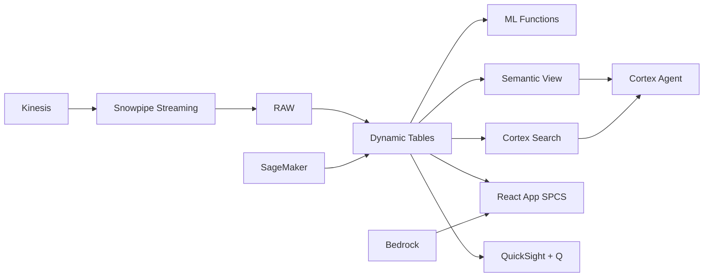

# Zakat & Waqf Management

Data-driven zakat collection and distribution for Indonesia's US$14B potential — ML.FORECAST predicts collection trends, Dynamic Tables build real-time muzakki/mustahik dashboards, and Cortex AI generates impact reports.

## Architecture

Indonesia's zakat potential is US$14 billion annually, but only 3% is collected through formal channels. BAZNAS must increase digital collection, retain high-value donors through personalized engagement, and prove impact through data-driven program evaluation — all while ensuring equitable distribution across 34 provinces to 8 asnaf categories.



## Snowflake Capabilities

| Capability | Implementation |
|-----------|---------------|
| Dynamic Tables | COLLECTION_DASHBOARD / DISTRIBUTION_EQUITY / DONOR_SEGMENTATION / IMPACT_METRICS |
| ML Functions | ML.FORECAST |
| Cortex AI | COMPLETE, SUMMARIZE, AI_CLASSIFY |
| Cortex Search | 80 documents indexed |
| Cortex Agent | ZAKAT_INTELLIGENCE_AGENT |
| Semantic View | ZAKAT_ANALYTICS |
| React App (SPCS) | 5 tabs + DemoGuide |


## AWS Services

| Service | Role in Demo |
|---------|-------------|
| Amazon Kinesis | Stream real-time donation transactions from digital channels |
| Amazon Personalize | Donor engagement and giving recommendations |
| AWS Glue | ETL for multi-channel collection data integration |
| Amazon SageMaker | Collection forecasting and donor churn prediction |
| Amazon Bedrock (Claude) | Generate impact reports and donor communications |
| Amazon QuickSight + Q | Zakat management dashboard with natural language |


## Personas

| Persona | Role | Key Questions |
|---------|------|---------------|
| **Prof. Dr. Noor Achmad** | Director of Collection | "Are we on track to meet the annual collection target?" "What's the digital vs offline collection ratio?" |
| **Fatimah Zahra** | Impact Measurement Analyst | "How many mustahik (beneficiaries) received assistance this quarter?" "Which programs have the highest poverty graduation rate?" |


## Data

| Table | Rows | Description |
|-------|------|-------------|
| MUZAKKI | 2,000,000 | Zakat payers (muzakki) with demographics, payment history, and channel preference |
| COLLECTIONS | 5,000,000 | Individual zakat, infaq, and sadaqah collection transactions |
| MUSTAHIK | 500,000 | Zakat beneficiaries (mustahik) with needs assessment and eligibility category |
| DISTRIBUTIONS | 1,000,000 | Zakat distribution records to 8 asnaf categories |
| PROGRAMS | 200 | Zakat distribution programs: education, health, economic empowerment, disaster relief |
| IMPACT_REPORTS | 80 | Program impact assessments, beneficiary surveys, and outcome evaluations |


## Build Instructions

### Prerequisites
- Snowflake account with ACCOUNTADMIN access
- Cortex AI enabled (ML Functions, Search, Agent)
- Warehouse: ZAKAT_WH (Medium)
- AWS CLI with access (us-west-2)

### Deployment

```bash
snowsql -f snowflake/00_setup.sql
snowsql -f snowflake/01_marketplace_install.sql
snowsql -f snowflake/02_raw_tables.sql
snowsql -f snowflake/03_staging.sql
snowsql -f snowflake/04_dynamic_tables.sql
snowsql -f snowflake/05_search.sql
snowsql -f snowflake/06_ml_models.sql
snowsql -f snowflake/07_semantic_view.sql
snowsql -f snowflake/08_agent.sql
```

### React App (SPCS)
```bash
cd app && npm ci && npm run build
docker build -t aws-indonesia-islamic-finance-zakat-app .
docker push bdiqc8sm-default.registry.snowflakecomputing.com/zakat_management/app/aws_indonesia_islamic_finance_zakat/app:latest
```

### Demo Mode
Open the app URL with `?demo=true` for presenter view.

## Build Modes

### Snowflake Only
Run scripts 00-08 (skip AWS-specific integration). Uses:
- **Snowpipe Streaming SDK** instead of Amazon Kinesis
- **Cortex Complete + ML.FORECAST** instead of Amazon Personalize
- **Dynamic Tables** instead of AWS Glue
- **ML.FORECAST** instead of Amazon SageMaker
- **Cortex Complete** instead of Amazon Bedrock (Claude)
- **Snowflake Intelligence (Cortex Analyst)** instead of Amazon QuickSight + Q

### Full AWS + Snowflake
Run all scripts including AWS integration. Deploy QuickSight dashboard from `quicksight/`.

## Business Impact

Industry research and Snowflake customer outcomes:
- **Indonesia's zakat collection reached IDR 26T ($1.6B) in 2024 — but potential is estimated at IDR 327T ($20B)** — [BAZNAS](https://baznas.go.id/en/publication/annual-report)
- **Only 30% of obligated Muslims in Indonesia pay zakat through official channels — digital platforms increasing compliance** — [KNEKS Indonesia](https://kneks.go.id/en/ikhtisar)
- **BAZNAS digitized zakat collection grew 65% in 2024 — mobile payments and e-wallets driving adoption** — [BAZNAS Digital Report](https://baznas.go.id/en/publication)
- **Mastercard uses Snowflake to enable financial inclusion analytics across emerging markets** — [Snowflake Financial Services](https://www.snowflake.com/en/data-cloud/financial-services/)

## Key Demo Numbers

- **Rp 21T** annual zakat collection (23% YoY growth)
- **2M muzakki** registered zakat payers
- **500K mustahik** beneficiaries served across 34 provinces
- **64% digital** collection via digital channels
- **23% graduation** poverty graduation rate from economic programs


## License

Apache 2.0 — See [LICENSE](LICENSE) for details.

This is a personal demo project and is not an official Snowflake offering. It comes with no support or warranty.