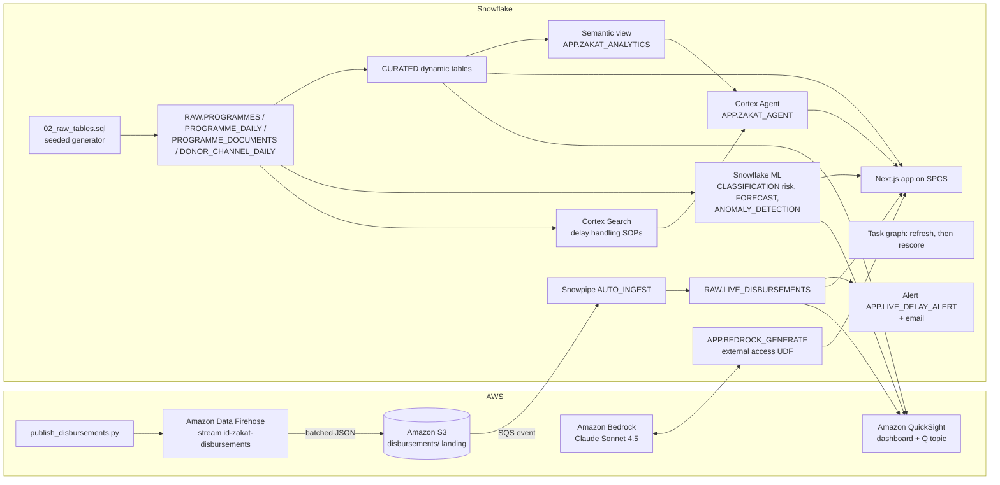

# Indonesia Zakat and Waqf Distribution Operations - Disbursement Delays and Donor Channels

End-to-end distribution operations for **40 zakat distribution programmes at a fictional Indonesian zakat and waqf management organisation across 5 cities** (Jakarta, Surabaya, Bandung, Medan, Makassar) using Snowflake, optionally with AWS: from a live delayed disbursement to a 7-day delay escalation risk score, an alert email and an AI action memo for the distribution team.

## Architecture

A distribution operations pipeline built on **Snowflake** (Dynamic Tables, Snowflake ML, Cortex Search, Cortex Agent, Cortex AI_COMPLETE, SPCS) and, in the full build, **AWS** (Amazon Data Firehose, S3, Bedrock Claude, QuickSight + Amazon Q). Disbursement events land in `RAW.LIVE_DISBURSEMENTS`. Dynamic tables curate 90 days of programme-day history: disbursements scheduled, delay cases, escalations to programme review, beneficiary notice SLA breaches, on-time disbursement rate and field verification compliance, plus daily donations by donor channel. Snowflake ML scores 7-day delay escalation risk per programme, forecasts organisation-wide delay volume and flags bank transfer rejection rate anomalies. A Cortex Agent answers questions with SOP citations, and an LLM drafts the distribution action memo.

The programmes cover five distribution types: food assistance, education scholarships, health assistance, disaster relief and economic empowerment. Beneficiary and donor figures are aggregate counts per day; there are no individual records. The demo models distribution operations only. It makes no religious or regulatory rulings, and its SOPs are synthetic.

Interactive diagrams (hover for object names): [Snowflake only](docs/architecture-snowflake.html) | [AWS + Snowflake](docs/architecture-aws.html). The app shows both on its Architecture & Data tab, the current build first. Regenerate them with `python3 docs/build_architecture.py`.


```mermaid
flowchart LR
    subgraph AWS
      SIM[publish_disbursements.py] --> FH[Amazon Data Firehose<br/>stream id-zakat-disbursements]
      FH -->|batched JSON| S3[(Amazon S3<br/>disbursements/ landing)]
      BR[Amazon Bedrock<br/>Claude Sonnet 4.5]
      QS[Amazon QuickSight<br/>dashboard + Q topic]
    end
    subgraph Snowflake
      S3 -->|SQS event| PIPE[Snowpipe AUTO_INGEST] --> LIVE[RAW.LIVE_DISBURSEMENTS]
      GEN[02_raw_tables.sql<br/>seeded generator] --> RAW[RAW.PROGRAMMES / PROGRAMME_DAILY /<br/>PROGRAMME_DOCUMENTS / DONOR_CHANNEL_DAILY]
      RAW --> DT[CURATED dynamic tables]
      RAW --> ML[Snowflake ML<br/>CLASSIFICATION risk, FORECAST,<br/>ANOMALY_DETECTION]
      DT --> SV[Semantic view<br/>APP.ZAKAT_ANALYTICS]
      RAW --> CS[Cortex Search<br/>delay handling SOPs]
      SV --> AG[Cortex Agent<br/>APP.ZAKAT_AGENT]
      CS --> AG
      LIVE --> AL[Alert APP.LIVE_DELAY_ALERT<br/>+ email]
      UDF[APP.BEDROCK_GENERATE<br/>external access UDF]
      TK[Task graph: refresh, then rescore]
      APP[Next.js app on SPCS]
    end
    BR <--> UDF
    DT --> APP
    ML --> APP
    LIVE --> APP
    AG --> APP
    UDF --> APP
    DT --> QS
    ML --> QS
    LIVE --> QS
```

The Snowflake-only build drops the AWS subgraph: `APP.SIMULATE_DISBURSEMENTS` writes to `RAW.LIVE_DISBURSEMENTS`, and the app calls Cortex `AI_COMPLETE` instead of the Bedrock UDF.

## Snowflake Capabilities

| Capability | Implementation |
|-----------|---------------|
| Dynamic Tables | `CURATED.KPI_SUMMARY`, `PERFORMANCE_SUMMARY`, `DELAY_SUMMARY`, `CHANNEL_SUMMARY`, `TREND_ANALYSIS` from the RAW tables |
| Snowflake ML | CLASSIFICATION 7-day delay escalation risk (`ML.ESCALATION_RISK_SCORES`), 14-day delay-volume FORECAST, bank transfer rejection rate ANOMALY_DETECTION |
| Cortex Search | 14 synthetic disbursement delay handling SOPs (one per programme type and delay reason) in `SEARCH.DISBURSEMENT_SOP_SEARCH` |
| Semantic View | `APP.ZAKAT_ANALYTICS` over programmes, delay reasons, donor channels, daily totals and risk |
| Cortex Agent | `APP.ZAKAT_AGENT`: Cortex Analyst over the semantic view plus Cortex Search for SOP citations |
| Cortex AI | `AI_COMPLETE('claude-sonnet-4-5')` for grounded answers, and for the action memo in the Snowflake-only build |
| Alerts + Tasks | `APP.LIVE_DELAY_ALERT` logs DELAYED disbursements and sends email; task graph `TASK_REFRESH_CURATED`, then `TASK_RESCORE_RISK` |
| Snowpark Container Services | Next.js app `APP.ID_ZAKAT_APP` with 6 tabs: Executive Cockpit, Predictive, Controls, Live Disbursements, Ask AI, Architecture & Data |
| Snowpipe | `RAW.LIVE_DISBURSEMENTS_PIPE` AUTO_INGEST from S3 (AWS build only) |

## AWS Services

Used only in the AWS + Snowflake build.

| Service | Role in Demo |
|---------|-------------|
| Amazon Data Firehose | Direct PUT stream `id-zakat-disbursements` receives simulated disbursement events and writes batches to S3 |
| Amazon S3 | Landing bucket (`disbursements/`). An event notification goes to the Snowpipe SQS queue |
| Amazon Bedrock | Claude Sonnet 4.5 writes the action memo, called from Snowflake through an external-access UDF |
| Amazon QuickSight | DIRECT_QUERY executive dashboard over Snowflake (daily delay cases, escalations by programme, escalation risk) |
| Amazon Q | Natural-language questions over the QuickSight topic `id-zakat-topic` |
| AWS IAM | Least-privilege roles for S3, Firehose and Bedrock |

## Personas

These personas are fictional.

| Persona | Role | Key Questions |
|---------|------|---------------|
| **Siti Rahmawati** | Head of Distribution | "What is our on-time disbursement rate?" "Which delay reasons turn into escalations to programme review?" "Which donor channels bring in the most?" |
| **Fajar Nugroho** | Programme Operations Analyst | "Which programmes are high risk this week, and which SOP applies?" |

## Data

All data is synthetic and seeded, so every rebuild reproduces it. The organisation, programmes and names are fictional; the cities are real Indonesian cities used as regions.

| Table | Rows | Description |
|-------|------|-------------|
| RAW.PROGRAMMES | 40 | Distribution programmes across 5 cities and 5 programme types (Food assistance, Education scholarship, Health assistance, Disaster relief, Economic empowerment), with a risk tier |
| RAW.PROGRAMME_DAILY | 3,600 | Daily programme observations over 90 days: disbursements scheduled, value (IDR), delay cases, escalations, notice SLA breaches, delay reason, field verification visits, bank transfer rejection rate and average days to disburse |
| RAW.PROGRAMME_DOCUMENTS | 40 | Required, on-file and pending programme file documents per programme |
| RAW.DONOR_CHANNEL_DAILY | 450 | Daily donation counts and IDR collected for 5 donor channels (QRIS, E-wallet, Bank transfer, Payroll deduction, Collection counter); aggregate only |
| SEARCH.DISBURSEMENT_DOCS | 14 | Synthetic disbursement delay handling SOPs indexed for Cortex Search |
| RAW.LIVE_DISBURSEMENTS | Grows during the demo | Live disbursement events from Firehose (AWS build) or `APP.SIMULATE_DISBURSEMENTS` (Snowflake-only build) |
| ML.ESCALATION_RISK_SCORES | 40 | 7-day escalation probability and risk band per programme |

## Build Instructions

### Prerequisites
- Snowflake account with ACCOUNTADMIN access, and Cortex AI enabled (AI_COMPLETE, Search, Agent).
- An X-Small warehouse with auto-suspend at or below 120 s, and an existing SPCS compute pool.
- Python 3.11+, `snowflake-connector-python`, Node.js 22+, Docker and the `snow` CLI.
- App image: run `snow spcs image-registry login`, then build and push `id-zakat-app:v1` to the database's `APP.IMAGES` repository (see the header of `snowflake/07_deploy_app.sql`).
- AWS build only: `boto3`, AWS credentials for the target account (us-west-2) with Bedrock access, and QuickSight Enterprise.

### SPCS App
```
<DATABASE>.APP.ID_ZAKAT_APP
```

### Tests
```bash
python -m pytest aws snowflake quicksight
```

For a local run, put `SNOWFLAKE_ACCOUNT`, `SNOWFLAKE_USER`, `SNOWFLAKE_DATABASE`, `SNOWFLAKE_WAREHOUSE`, `SNOWFLAKE_AUTHENTICATOR=PROGRAMMATIC_ACCESS_TOKEN`, `SNOWFLAKE_TOKEN` and `DEMO_PLATFORM` in the environment, then run `npm --prefix app run build && npm --prefix app start`.

## Build Modes

Both modes share the same core. They differ in three places, and the app's `DEMO_PLATFORM` setting (in its SPCS spec) switches the memo provider and the Live Disbursements tab.

| Layer | Snowflake Only | Full AWS + Snowflake |
|---|---|---|
| Live disbursements | `CALL APP.SIMULATE_DISBURSEMENTS(n)` inserts simulated disbursement events into `RAW.LIVE_DISBURSEMENTS`. This simulates a disbursement feed; it is not Snowpipe Streaming | `aws/publish_disbursements.py` to Amazon Data Firehose, then S3, SQS and Snowpipe AUTO_INGEST |
| Action memo | Cortex `AI_COMPLETE('claude-sonnet-4-5')` | Amazon Bedrock Claude Sonnet 4.5 through `APP.BEDROCK_GENERATE` |
| BI and natural-language questions | The SPCS app is the dashboard; questions go to the Cortex Agent | Also a QuickSight dashboard and an Amazon Q topic |
| App setting | `DEMO_PLATFORM: snowflake` | `DEMO_PLATFORM: aws` |

### Snowflake Only

```bash
# 1. Core data and dynamic tables (guarded: new isolated database only)
python snowflake/run_core.py --database INDONESIA_ZAKAT_SNOWFLAKE --warehouse <XS_WAREHOUSE> --connection <CONNECTION> --apply
# 2. Native disbursement feed, ML, search, semantic view, agent, alert and task graph
python snowflake/run_intelligence.py --database INDONESIA_ZAKAT_SNOWFLAKE --platform snowflake --warehouse <XS_WAREHOUSE> --connection <CONNECTION> --alert-email you@example.com
# 3. App on SPCS with DEMO_PLATFORM=snowflake (push the image first)
python snowflake/run_intelligence.py --database INDONESIA_ZAKAT_SNOWFLAKE --platform snowflake --warehouse <XS_WAREHOUSE> --connection <CONNECTION> --alert-email you@example.com --files 07_deploy_app.sql --compute-pool <COMPUTE_POOL>
```

During the demo:
- Run `CALL APP.SIMULATE_DISBURSEMENTS(20)` to add live disbursement events. For a continuous feed, run `ALTER TASK APP.TASK_SIMULATE_DISBURSEMENTS RESUME`, and `SUSPEND` it afterwards.
- Run `EXECUTE ALERT APP.LIVE_DELAY_ALERT` to raise the alert email.
- Run `EXECUTE TASK APP.TASK_REFRESH_CURATED` to refresh the curated tables and rescore delay escalation risk.

Afterwards, drop the database or run `ALTER SERVICE APP.ID_ZAKAT_APP SUSPEND`.

### Full AWS + Snowflake

```bash
# 1. Core data and dynamic tables (guarded: new isolated database only)
python snowflake/run_core.py --database INDONESIA_ZAKAT_AWS --warehouse <XS_WAREHOUSE> --connection <CONNECTION> --apply
# 2. AWS ingestion and Bedrock (dry run first, then --apply)
python aws/setup_aws.py --database INDONESIA_ZAKAT_AWS --account <AWS_ACCOUNT_ID> --connection <CONNECTION> --apply
# 3. ML, search, semantic view, agent, alert and task graph
python snowflake/run_intelligence.py --database INDONESIA_ZAKAT_AWS --platform aws --warehouse <XS_WAREHOUSE> --connection <CONNECTION> --alert-email you@example.com
# 4. App on SPCS with DEMO_PLATFORM=aws (push the image first)
python snowflake/run_intelligence.py --database INDONESIA_ZAKAT_AWS --platform aws --warehouse <XS_WAREHOUSE> --connection <CONNECTION> --alert-email you@example.com --files 07_deploy_app.sql --compute-pool <COMPUTE_POOL>
# 5. QuickSight dashboard and Q topic (needs an existing Snowflake data source)
python quicksight/build_dashboards.py --database INDONESIA_ZAKAT_AWS --account <AWS_ACCOUNT_ID> --principal-arn <QUICKSIGHT_USER_ARN> --data-source-arn <DATA_SOURCE_ARN> --prefix id-zakat --apply --update --with-topic
```

QuickSight objects must be shared with the QuickSight user who signs in (`--principal-arn`); otherwise the console shows nothing.

During the demo:
- Run `python aws/publish_disbursements.py --count 20` to send live disbursement events. Firehose buffers for up to 60 seconds before writing to S3.
- Run `EXECUTE ALERT APP.LIVE_DELAY_ALERT` to raise the alert email.
- Run `EXECUTE TASK APP.TASK_REFRESH_CURATED` to refresh the curated tables and rescore delay escalation risk.

Afterwards, `python aws/teardown_aws.py --database INDONESIA_ZAKAT_AWS --account <AWS_ACCOUNT_ID> --connection <CONNECTION> --apply` removes the AWS resources and the account-level Bedrock external-access and S3 storage integrations. It leaves the email integration `ID_ZAKAT_EMAIL_INT`, which the Snowflake-only build also uses.

## Business Impact

Industry context and Snowflake customer outcomes:
- **National zakat collection target of Rp50.06 trillion for 2025**: BAZNAS reports that its 2025 plan includes a "proyeksi pengumpulan nasional sebesar Rp50.063.628.901.276" (national collection projection) -- [BAZNAS news, 5 February 2025: Apresiasi Kinerja BAZNAS, Komisi VIII DPR RI Dorong Pencapaian Target Penghimpunan ZIS-DSKL 2025](https://baznas.go.id/news-show/BAZNAS_Catat_Pengumpulan_ZIS_DSKL_Nasional_2024_Capai_Rp41_Triliun/2846)
- **Saxo Bank** (Snowflake customer): "Banking on Big Data: Snowflake Enables Saxo Bank to Grow in Size and Agility" -- [Snowflake customer story: Saxo Bank](https://www.snowflake.com/en/customers/all-customers/case-study/saxo-bank/)

## Key Demo Numbers

These figures are synthetic and come from the seeded demo data. Forecast and anomaly figures can shift slightly with the build day.

- **40 programmes** across 5 Indonesian cities and 5 programme types, 3,600 programme-days over 90 days; **665,094 disbursements scheduled** worth IDR 406 B
- **On-time disbursement rate 99.91%**: **583 delay cases**, of which **198** were escalated to programme review (escalation rate 34.0%); **95 beneficiary notice SLA breaches**
- **Supplier delivery delay** produces the most escalations (49 of 127 cases); the 16 bank transfer outage cases always resolve without escalation
- **Escalation risk model** out-of-time holdout (600 programme-days): precision 0.49, recall 0.34 at a 0.5 threshold, against a 0.22 base rate. Six programmes are high risk; the top programme is PRG-0005, at 95.3%
- **14-day delay forecast** with prediction intervals (about 93 delay cases in total); **26 of 640** programme-days flagged as bank transfer rejection rate anomalies
- **Field verification compliance 81.0%**, programme file coverage 49.0%, with 22 documents pending
- **IDR 426 B collected** over 90 days; digital channels (QRIS, e-wallet, bank transfer) are 83.1% of it, and bank transfer alone is 58.4%
- **14 SOPs** indexed for Cortex Search and cited by ID in agent answers

## License

Apache 2.0 — See [LICENSE](LICENSE) for details.

This is a personal demo project and is not an official Snowflake offering. It comes with no support or warranty. Industry figures cited are from publicly available sources and Snowflake customer stories; they represent reported figures and are not guarantees of results. The demo does not provide religious, legal or regulatory advice.
